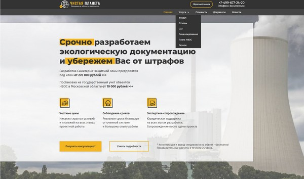
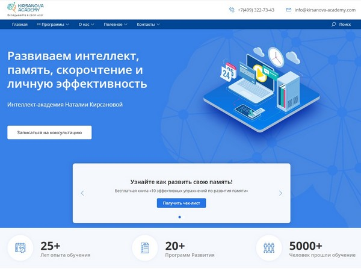
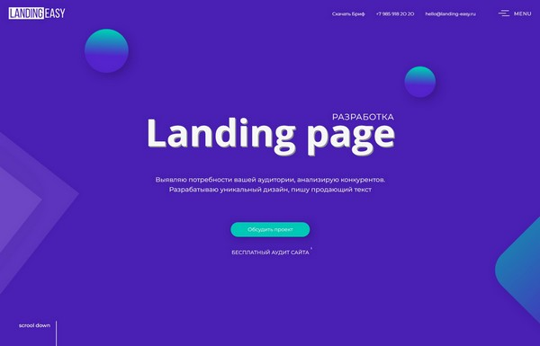
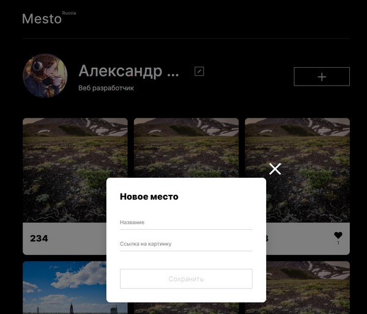
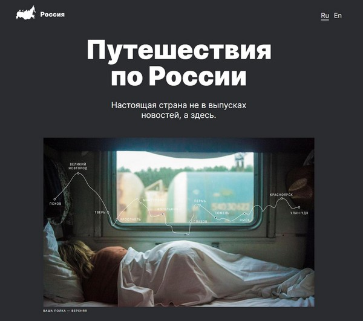
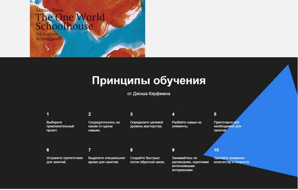

# 🖖&nbsp;Приветствую! Меня зовут Александр Шелухин

&nbsp;
&nbsp;
&nbsp;

## 🤗 Обо мне
* Занимаюсь разработкой сайтов и лендингов, отлично верстаю и владею приемами анимации.
* Настрою управление сайтом на Wordpress под любые потребности.
* Изучаю JavaScript и развиваюсь именно в этом напрвлении. 
* Уже успел освоить:
    - Валидацию форм на чистом JS
    - Разработку в разрезе парадигм ООП 👌
    - Классы, прототипы, промисы
    - Сборку собственного Api

 ### 👍 Ближайшие планы по развитию:
* Больше практики в React'e 🚀
* Освоить Node.js
* Писать чистый код
* Освоить новые инструменты и фреймворки 🧙‍♂️

 #### 🔧 Стек
&nbsp;
&nbsp;
&nbsp;
&nbsp;
&nbsp;
&nbsp;
\
&nbsp;
&nbsp;
&nbsp;
&nbsp;
&nbsp;
\
&nbsp;
&nbsp;
&nbsp;
&nbsp;
\
&nbsp;
&nbsp;
&nbsp;
&nbsp;
\
&nbsp;
&nbsp;
&nbsp;

***
### 📌 Мои некоторые проекты
### ✔️ &nbsp;**Чистая планета** 

* Проект состоит из презентации услуг компании по разработке экологической документации. 
Включает в себя новостную ленту в виде блога, раздел с описанием оказываемых услуг реализованный в виде "аккордеона" и возможностью скачивать актуальные нормативные документы. Также имеется возможность оставить заявку и запросить обратный звонок и онлайн чат с оператором. 
Сайт имеет административную панель, через которую можно изменить весь необходимый контент на сайте (включая текст и картинки), 
а также обновлять/добавлять новости, услуги и документы.
Верстка адаптивная и кроссбраузерная. Дизайн сайта разработан мной

##### Технологии: 
&nbsp;
&nbsp;
&nbsp;

&nbsp;
&nbsp;
&nbsp;

##### Ссылка на проект: https://eco-documents.ru
  &nbsp;
 

### ✔️ &nbsp; **Интеллект-академия Наталии Кирсановой** 

* На главной странице сайта реализована презентация Академии. На сайте создан каталог учебных программ. В каталоге присутствует фильтр и навигация по категориям программ, а в описании программ реализована возможность покупки. Имеется блог с навигацией и фильтром, подписка на рассылку. Сайт имеет административную панель, через которую можно изменить весь необходимый контент на сайте (включая текст и картинки), а так же обновлять/добавлять новости, программы и документы.
Верстка адаптивная и кроссбраузерная. Дизайн сайта разработан мной

##### Технологии: 
&nbsp;
&nbsp;
&nbsp;

&nbsp;
&nbsp;
&nbsp;

##### Ссылка на проект: https://kirsanova-academy.com/
  &nbsp;

### ✔️ &nbsp; **Сайт Landing-Easy - презентация моих услуг** 

* Сайт создан для презентации моих услуг. Есть возможность оставить заявку на разработку и аудит, а так же скачать брифинг. 
Реализовано плавное меню со скролом к указанным разделам. Сделал оригинальный checkbox подтверждения в формах отправки
Верстка адаптивная и кроссбраузерная. Дизайн сайта разработан мной

##### Технологии: 
&nbsp;
&nbsp;
&nbsp;

&nbsp;
&nbsp;
&nbsp;

##### Ссылка на проект: https://landing-easy.ru
  &nbsp;

### ✔️ &nbsp; **Веб-сервис Mesto Россия** 

##### Технологии: 
&nbsp;
&nbsp;
&nbsp;
&nbsp;
\
&nbsp;
&nbsp;
&nbsp;
&nbsp;

##### Подробнее о проекте: https://github.com/Aleksandr-Shelukhin/mesto
  &nbsp;

### ✔️ &nbsp; **Путешествие по России** 

##### Технологии: 
&nbsp;
&nbsp;
&nbsp;
&nbsp;
&nbsp;
&nbsp;

##### Подробнее о проекте: https://github.com/Aleksandr-Shelukhin/russian-travel
  &nbsp;

### ✔️ &nbsp; **Найчиться учиться** 

##### Технологии: 
&nbsp;
&nbsp;
&nbsp;
&nbsp;
&nbsp;
&nbsp;

##### Подробнее о проекте: https://github.com/Aleksandr-Shelukhin/how-to-learn
  &nbsp;